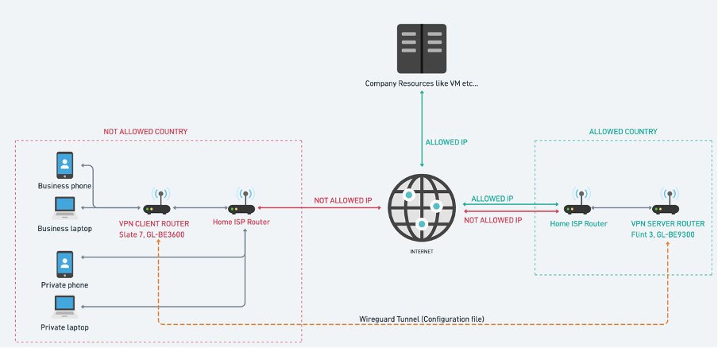
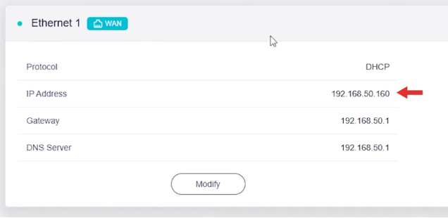
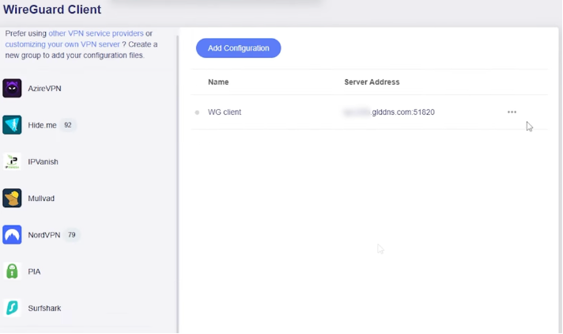
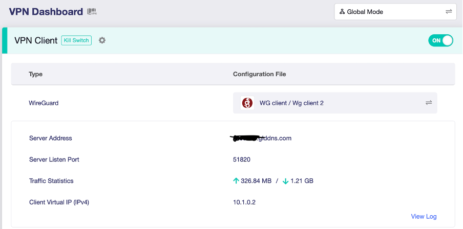
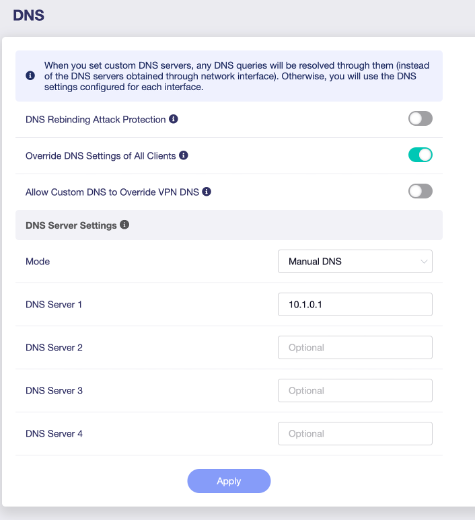
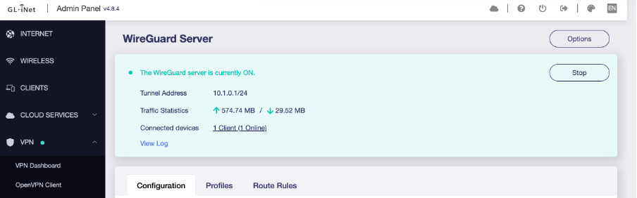

# How to Set Up a VPN Client and VPN Server Router ([Youtube tutorial](https://www.youtube.com/watch?v=v_DyRGicWco&list=PLRKQGqHIdxtILJVquH9kDaFHCEvHy2j2_&t=32s))

> **Colour legend used throughout this guide:**
> - $\color{green}{\text{Green}}$ — infrastructure located in the **allowed country** (VPN Server Router, Flint 3, local Home/ISP Router)
> - $\color{red}{\text{Red}}$ — infrastructure located in the **non-allowed country** (VPN Client Router, Slate 7, local Home/ISP Router)
>
> This matches the colour coding used in the architecture diagram.

> **Note:** Claude Sonnet was used during the creation of this guide — for explaining certain concepts, describing parts of the router admin UI, and providing information about various security risks and leaks. If any part of the instructions or the router UI is unclear, it is a good starting point for follow-up questions.

## The Problem and Solution

Your company does not allow you to access its resources from outside of an approved country.

**Solution:** Make your internet traffic appear as if it is coming from the $\color{green}{\text{allowed country}}$ by routing it through a router located there.

Think of it like this: instead of your laptop talking directly to your company, it whispers to a trusted friend in the right country, and that friend talks to your company on your behalf.

Technically, your hotspot or ISP Router normally sends data directly to your company's resources. The goal is to forward that data through another device (a router in the allowed country) that has an approved IP address, which then communicates with your company on your behalf.

> **What is an IP address?** Every device connected to the internet has an IP address — a number that identifies where you are connecting from, similar to a home address. Your company checks this to see if you are connecting from an allowed country.

This can be done in two ways:

1. **$\color{red}{\text{VPN Client Router}}$ with a VPN Provider** *(e.g. Proton VPN, NordVPN)* — Easy to set up, but your company's security team may recognise the IP address as belonging to a VPN service and block it.

2. **$\color{red}{\text{VPN Client Router}}$ + $\color{green}{\text{VPN Server Router}}$** — Your business devices appear to connect from a regular home internet connection in the allowed country, which looks completely normal and is much harder to detect.

> **We will proceed with the safer two-router solution.**

> 📺 **This guide is meant to be followed alongside this YouTube tutorial — the steps and notes here are supplementary to the video, not a replacement for it:**
> [YouTube — VPN Client & Server Router Setup](https://www.youtube.com/watch?v=v_DyRGicWco&list=PLRKQGqHIdxtILJVquH9kDaFHCEvHy2j2_&t=32s)

---

## Architecture Overview



Both routers were ordered from the official GL.iNet website:
- **$\color{green}{\text{VPN Server Router}}$:** [Flint 3 (GL-BE9300)](https://www.gl-inet.com) — plugged in at a location in the allowed country (e.g. a family member's home)
- **$\color{red}{\text{VPN Client Router}}$:** [Slate 7 (GL-BE3600)](https://www.gl-inet.com) — with you, wherever you are working from

> **$\color{green}{\text{What is a VPN Server?}}$** The VPN Server is the router that sits in the $\color{green}{\text{allowed country}}$ and waits for incoming connections. It is the "host" — it receives your traffic, forwards it to the internet, and sends the response back to you. Because the traffic exits to the internet from its location, websites and your company see the server's IP address (from the $\color{green}{\text{allowed country}}$), not yours.

> **$\color{red}{\text{What is a VPN Client?}}$** The VPN Client is the router you travel with. It is the one that initiates the connection — it reaches out to the $\color{green}{\text{VPN Server}}$ and establishes an encrypted tunnel through which all your traffic is sent. Your business devices connect to this router's Wi-Fi and are completely unaware that their traffic is being routed halfway across the world.

All your business devices (laptop, phone, etc.) connect to the **$\color{red}{\text{Slate 7}}$**. It sends all traffic through an encrypted tunnel to the **$\color{green}{\text{Flint 3}}$** back home, which then forwards it to the internet. From your company's perspective, the traffic looks like it is coming from the $\color{green}{\text{allowed country}}$.

---

## Important Notes Before You Start

- **Separate business and private devices.** Do not use private devices for business purposes.
- **Business devices must always be connected to the $\color{red}{\text{VPN Client Router (Slate 7)}}$.** Never connect them directly to a local hotel Wi-Fi, hotspot, or ISP without going through $\color{red}{\text{Slate 7}}$ first.
- Keep firmware updates for both routers scheduled on **non-working days**. A firmware update will trigger an automatic reboot, and the router may prompt you to confirm whether to keep the existing configuration — make sure someone is physically near the router to handle any such prompts and confirm the router comes back up correctly.

### What if you need to go outside with a business phone?

The core issue is that the $\color{red}{\text{Slate 7}}$ is normally plugged into a power outlet at your home office, so carrying it around requires some extra preparation.

There are two options:

- **Option 1 *(most secure)*:** Carry your **private phone** (used as a hotspot), your **business phone**, and the **$\color{red}{\text{Slate 7}}$** running off an external battery pack. Connect $\color{red}{\text{Slate 7}}$ to your private phone's hotspot, and connect your business phone to $\color{red}{\text{Slate 7}}$'s Wi-Fi as usual. Everything stays fully protected — same setup as at home, just portable.

- **Option 2 *(simpler but less safe — not tested)*:** Use your **private phone** as a hotspot with a VPN provider app installed (e.g. Proton VPN), and connect your business phone directly to it. Your business phone will get an IP address from the VPN provider rather than from your home ISP, and your company's security may recognise it as a VPN IP address range. ⚠️ *This option has not been tested.*

---

## Setup Steps

### $\color{green}{\text{Step 1 — Set Up the Flint 3 (GL-BE9300) VPN Server Router}}$

This router stays in the $\color{green}{\text{allowed country}}$ (e.g. at home or at a relative's place). It acts as your "entry point" into the trusted network.

1. Turn on the $\color{green}{\text{Flint 3}}$ router and connect it to the $\color{green}{\text{Home/ISP Router}}$ there:
   - Via **ethernet cable:** plug into the **WAN port** on $\color{green}{\text{Flint 3}}$ and a **LAN port** on the $\color{green}{\text{Home/ISP Router}}$.
   - Or connect it via **Wi-Fi** to the home network.
2. On your laptop, find the $\color{green}{\text{Flint 3}}$ Wi-Fi network (the name/SSID starts with `GL-BE9300`) and connect to it.
3. Open a browser and go to `192.168.8.1` — this is the router's settings page (admin panel). Create your admin password when prompted.
4. Note down the IP address of the $\color{green}{\text{Flint 3}}$ router — it is shown on the Home page or the Internet tab.

   
5. *(Optional but recommended)* Update the router firmware at this stage.

---

### $\color{green}{\text{ Step 2 — Configure Port Forwarding on the Home/ISP Router }}$

Port forwarding tells the $\color{green}{\text{Home/ISP Router}}$ to pass incoming VPN traffic through to the $\color{green}{\text{Flint 3}}$, rather than blocking it. Think of it as telling the front door to let a specific type of delivery through directly to a specific room.

Log in to the $\color{green}{\text{Home/ISP Router}}$ admin panel (typically at `192.168.1.1`) and configure port forwarding as shown in the reference YouTube tutorial.

Port forwarding is set up **between the $\color{green}{\text{Home/ISP Router}}$ and the $\color{green}{\text{Flint 3 (GL-BE9300) Router}}$**.

> **Note for Hrvatski Telekom users:** Access router settings via the **Hrvatski Telekom mobile app**. The advanced options are hidden behind a UI bug — click the **"Change Wi-Fi name and password"** button, and the advanced internet/port forwarding options will appear alongside it.

---

### $\color{green}{\text{Step 3 — Complete VPN Server Setup on Flint 3 (GL-BE9300)}}$

Now we configure $\color{green}{\text{Flint 3}}$ to act as a $\color{green}{\text{VPN Server}}$ — meaning it will accept secure, encrypted connections from the $\color{red}{\text{Slate 7}}$ wherever you are in the world.

1. In the $\color{green}{\text{Flint 3}}$ admin panel, go to **Applications > Dynamic DNS**.
   - Enable **Dynamic DNS (DDNS)** and note down the **hostname** (e.g. `abc123.gl-inet.com`).
   - *Why?* Your home internet's IP address changes periodically. DDNS gives it a fixed, permanent name so $\color{red}{\text{Slate 7}}$ can always find it.

2. Go to **VPN > $\color{green}{\text{WireGuard Server}}$** and add a new configuration.
   - WireGuard is the VPN protocol used to create the encrypted tunnel between the two routers.
   - The gateway IP address (`10.1.0.1`) was set automatically — leave it as is.

3. Follow the tutorial to generate and **download the configuration file**. This file will be uploaded to $\color{red}{\text{Slate 7}}$ in the next step.

4. **Important:** Open the downloaded config file in a text editor and find the `Endpoint` field under `[Peer]`. If it shows an IP address, **replace it with your DDNS hostname**. This is critical — IP addresses change, but the hostname stays the same.

The config file will look something like this:

```ini
[Interface]
Address = 10.1.0.2/24
PrivateKey = <privateKey>
DNS = 10.1.0.1        # Important — used in Step 5
MTU = 1420

[Peer]
AllowedIPs = 0.0.0.0/0, ::/0
Endpoint = <YOUR-DDNS-HOSTNAME>:51820   # Use hostname, NOT IP address!
PersistentKeepalive = 25
PublicKey = <publicKey>
```

---

### $\color{red}{\text{Step 4 — Set Up the Slate 7 (GL-BE3600) VPN Client Router}}$

This is the router you carry with you. It connects to whatever $\color{red}{\text{local internet is available (hotel Wi-Fi, hotspot, etc.)}}$ and automatically routes all your business device traffic through the secure tunnel to $\color{green}{\text{Flint 3}}$.

1. Turn on the $\color{red}{\text{Slate 7}}$ and connect it to a **different network** than the one $\color{green}{\text{Flint 3}}$ is on (e.g. your mobile hotspot or another Wi-Fi).
2. On your laptop, find the $\color{red}{\text{Slate 7}}$ Wi-Fi network (SSID starts with `GL-BE3600`) and connect to it.
3. Open a browser and go to `192.168.8.1` to access the admin panel. Set up your admin password when prompted.
4. *(Optional but recommended)* Update the firmware at this stage.
5. Go to **VPN > $\color{red}{\text{WireGuard Client}}$**.
   - Add a new group (e.g. name it `WG Client`).
   - Upload the configuration file downloaded in Step 3 and click **Apply**.
   - Double-check that the **Server Address** field shows the **DDNS hostname**, not an IP address.

   
6. Click the **three dots (⋮)** next to the configuration and select **Activate** to start the VPN tunnel.

---

### Step 5 — Verify the Connection and Fix DNS

1. In the $\color{red}{\text{Slate 7}}$ admin panel, check the **WireGuard status** — it should be green and active.
2. Check the **VPN Dashboard** — it should also show green/active.



> **Note:** In the image above you will notice two configurations — `WG Client` and `WG Client 2`. `WG Client` is the incorrect one that uses an IP address in the Endpoint field instead of the DDNS hostname. It has not been deleted but should be ignored — `WG Client 2` is the correct, active configuration using the DDNS hostname.

#### Fix DNS (Important)

DNS is like a phone book for the internet — it translates website names (e.g. `google.com`) into IP addresses computers use to connect. Every ISP has its own DNS server, and using the wrong one can reveal your real location even if your IP address is hidden (this is called a DNS leak).

By default, $\color{red}{\text{Slate 7}}$ might use the DNS of whatever local internet it is connected to $\color{red}{\text{(e.g. a foreign ISP)}}$. We need to tell it to use $\color{green}{\text{Flint 3's DNS}}$ instead, so all lookups appear to come from the $\color{green}{\text{allowed country}}$.

In the $\color{red}{\text{Slate 7}}$ admin panel, go to **Network > DNS**, switch to **Manual mode**, and enter the DNS IP from the config file (the `DNS` value under `[Interface]`, e.g. `10.1.0.1`).



> This routes all DNS requests from $\color{red}{\text{Slate 7}}$ through $\color{green}{\text{ Flint 3}}$, which uses the DNS of the $\color{green}{\text{home ISP in the allowed country}}$.

3. Try browsing on a device connected to $\color{red}{\text{Slate 7's Wi-Fi}}$ — it should work normally.
4. In the $\color{green}{\text{Flint 3}}$ admin panel, go to **VPN > WireGuard Server** — you should see an active connection from $\color{red}{\text{the VPN Client (Slate 7)}}$.

   

5. As a final check, verify that a device connected to the $\color{red}{\text{Slate 7}}$ Wi-Fi has the **same public IP address** as a device connected directly to the $\color{green}{\text{Home/ISP Router}}$ (the one the $\color{green}{\text{Flint 3}}$ is plugged into). You can check the public IP on both devices by visiting [whatismyipaddress.com](https://whatismyipaddress.com). If both show the same IP, the tunnel is working correctly and your traffic is exiting through the $\color{green}{\text{allowed country}}$.

---

## Security Checklist — What to Watch Out For

> **Note:** The security risks listed in this section were researched and explained with the help of Claude Sonnet.

### ✅ IP Leak — Enable Kill Switch
If the VPN tunnel between $\color{red}{\text{Slate 7}}$ and $\color{green}{\text{Flint 3}}$ drops unexpectedly, $\color{red}{\text{Slate 7}}$ might fall back to routing your traffic directly through $\color{red}{\text{the local internet}}$, exposing your $\color{red}{\text{real IP address}}$ to your company.

**Fix:** Enable the **Kill Switch** on $\color{red}{\text{Slate 7}}$. This completely blocks all internet traffic if the VPN tunnel goes down — nothing gets through until the tunnel is back up. *(Note: this appears to be enabled by default, but it is worth double-checking.)*

---

### ✅ DNS Leak
Even with a VPN active, your device might still send DNS requests (website name lookups) through the local ISP instead of through the VPN tunnel, revealing your real location.

**Fix:** Covered in Step 5 — set DNS to Manual mode on $\color{red}{\text{Slate 7}}$ and point it to `10.1.0.1` ($\color{green}{\text{Flint 3's gateway IP)}}$, so all lookups go through the VPN.

---

### ✅ WebRTC Leak
WebRTC is a technology built into browsers that enables video and audio calls (e.g. Google Meet in Chrome). It can reveal your real IP address directly, bypassing the VPN entirely.

**Fix:** Use **desktop apps** for calls and meetings (Teams, Zoom, Outlook) rather than browser-based versions. If you must use a browser, install a WebRTC-blocking extension.

---

### ✅ Geolocation
Websites and web apps can ask your browser for your physical location using the device's GPS or Wi-Fi signals. This bypasses IP-based location entirely.

**Fix:** In your browser settings, set location permissions to **blocked by default**. Deny any per-site location requests.

---

### ✅ Routing Leak
If the VPN tunnel is not configured as a full tunnel, some traffic might bypass it and go directly to the internet without being routed through $\color{green}{\text{Flint 3}}$.

**Fix:** $\color{red}{\text{Slate 7}}$ routes all traffic through the VPN by default. You can verify this by stopping the $\color{red}{\text{WireGuard Client}}$ on $\color{red}{\text{Slate 7}}$ — any device connected to its Wi-Fi should immediately lose internet access entirely.

---

### ✅ IPv6
Most of the internet still uses IPv4 addresses (e.g. `192.168.1.1`), but IPv6 is the newer standard. If your device uses IPv6 and the VPN tunnel only covers IPv4, the IPv6 traffic may leak outside the tunnel.

**Fix:** Disable IPv6 on both routers for now. The current setup does not use IPv6 at all. This is worth revisiting in the future as IPv6 adoption grows.

---

### ✅ Device Fingerprint
Websites do not only look at your IP address — they can also detect your location from browser and device settings like timezone, keyboard layout, OS language, and system locale.

**Fix:** Make sure all business devices have their **timezone, keyboard layout, OS locale, and language** configured to match the allowed country.

---

## Testing & Verification Sites

Use these sites to verify your setup is leak-free:

| Site | Purpose |
|------|---------|
| [whatismyipaddress.com](https://whatismyipaddress.com) | Check your public IP address |
| [dnsleaktest.com](https://www.dnsleaktest.com) | Check for DNS leaks |
| [ipleak.net](https://ipleak.net) | Check for IP, DNS, and WebRTC leaks |
| [browserleaks.com](https://browserleaks.com) | Check for various browser-based leaks |
